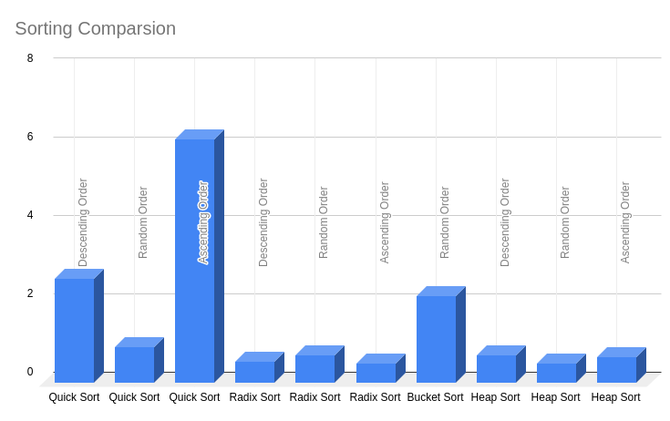

## Sorting - Experiment
### Status  :   Completed
### Fowzy Alsaud
### Description    :
> So in this assignment I decided to use Python which I know is slower but I just want to see the different and try something different and I did created two lists of integers one in Random Order and one in Descending Order and I did created two lists of float as well and I did attached the comparesion in schuedle and in a chart as you can see.

### Time Difference (Scheduling model)
|   Sorting Algorithms.   | Type     | Time |   List    |
| :---: | -------- | -------------------------------- | ----- |
|   1   | Quick Sort | Integers |   2.638911485671997   | Descending Order|
|   2   | Quick Sort | Integers |   0.8863976001739502   | Random Order  |
|   3   | Quick Sort | Integers |   6.198487281799316   |   Ascending Order |
|   4   | Radix Sort | Integers |   0.5291564464569092   |  Descending Order  |
|   5   | Radix Sort | Integers |   0.678581714630127   |  Random Order  |
|   6   | Radix Sort | Integers |   0.47701311111450195   |  Ascending Order  |
|   7   | Bucket Sort | Float |   2.1921350955963135   | Random Order|
|   8   | Heap Sort | Integers |   0.6983213424682617   |Descending Order|
|   9   | Heap Sort | Integers |   0.48491787910461426   |Random Order|
|   10   | Heap Sort | Integers |   0.6331014633178711   |Ascending Order|

# Time Difference (Chart model)

### Files  :
|   #   | File     | Description                      |
| :---: | -------- | -------------------------------- |
|   1   | [README.md](README.md) | ReadMe File |
|   2   | [heap.py](heap.py) | Heap Sort File |
|   3   | [counting.py](counting.py) | Counting Sort File |
|   4   | [quicksort.py](quicksort.py) | Quick  Sort File |
|   5   | [radix.py](radix.py) | Radix Sort |
|   6   | [bucket.py](bucket.py) | Bucket Sort |
|   7   | [chart.png](chart.png) | Chart Picture |

### Instructions:
- This project was complied using C++ 17

### Sources:
- <a href="#">G O O G L E</a>

(I used these sources to help me understand)
